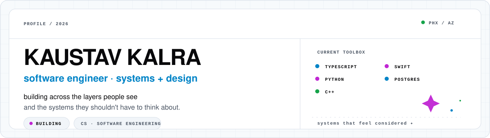
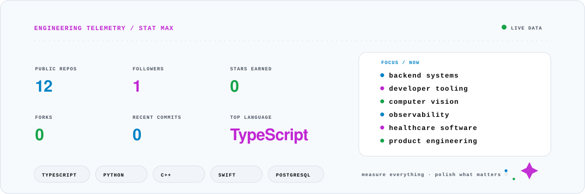
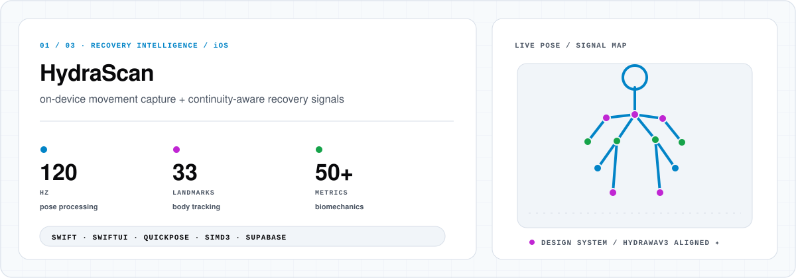
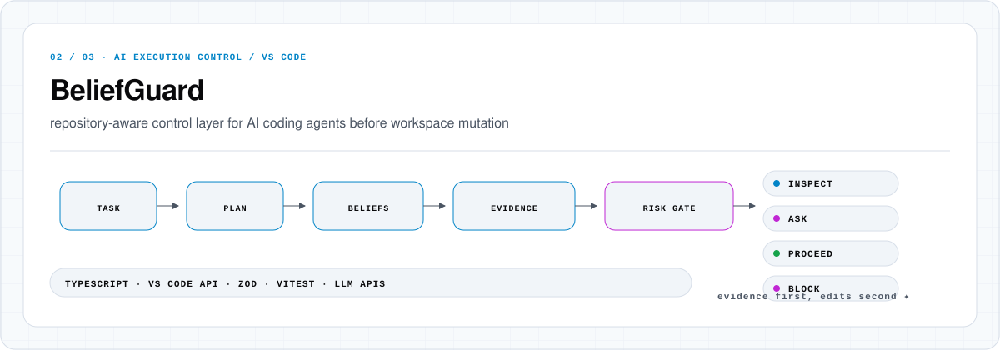
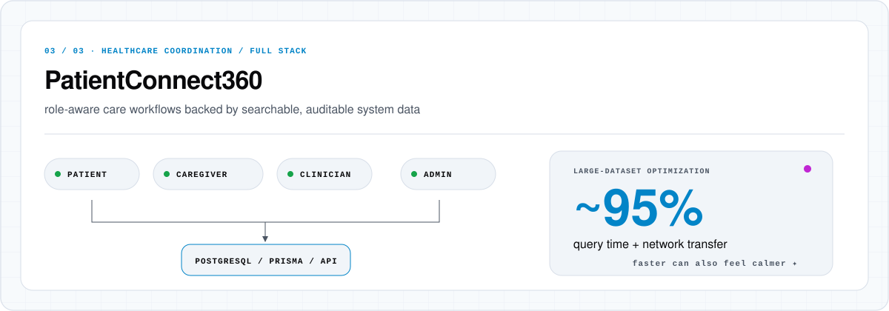

<picture>
  <source media="(prefers-color-scheme: dark)" srcset="./assets/hero-dark.svg">
  <source media="(prefers-color-scheme: light)" srcset="./assets/hero-light.svg">
  
</picture>

<br>

i like building software where **technical depth and product design are treated as the same problem**.

my work has moved across backend systems, developer tooling, computer vision, healthcare software, AI-assisted workflows, and mobile products, but the underlying pattern lies between what a system does internally and what using it actually feels like.

| systems | product | signal |
| --- | --- | --- |
| backend architecture | interface systems | observability |
| data modeling | interaction design | metrics |
| reliability | visual language | validation |
| performance | workflow design | testing |

<sub>currently: making the invisible parts feel intentional ✦</sub>

---

## engineering telemetry

<picture>
  <source media="(prefers-color-scheme: dark)" srcset="./assets/telemetry-dark.svg">
  <source media="(prefers-color-scheme: light)" srcset="./assets/telemetry-light.svg">
  
</picture>

<div align="center">


<sub>numbers, but make them pretty ♡ · #050509 / #FF4FD8 / #63F58B / #7DD3FC</sub>

</div>

<br>

<p align="center">
  
  
</p>

<p align="center">
  
</p>

<p align="center">
  
</p>

---

## selected systems

### [HydraScan](https://github.com/kaus-h/HydraScan)

<picture>
  <source media="(prefers-color-scheme: dark)" srcset="./assets/projects/hydrascan-dark.svg">
  <source media="(prefers-color-scheme: light)" srcset="./assets/projects/hydrascan-light.svg">
  
</picture>

**on-device ML recovery intelligence for iOS.** HydraScan analyzes biomechanical movement using pose estimation and deterministic scoring, processing **33-point pose data at 120Hz** and computing **50+ biomechanical metrics**.

<details>
<summary><strong>engineering notes / architecture</strong></summary>
<br>

**Tech:** Swift, SwiftUI, MVVM, SwiftData, HealthKit, QuickPose, MediaPipe, SIMD3

- Scores squat, hip hinge, posture, balance, range of motion, and asymmetry.
- Uses NaN-safe joint-angle calculations and fallback logic for incomplete pose data.
- Built as a **12K+ line SwiftUI/MVVM client across 59 files**.
- Includes a reusable **700+ line SwiftUI design system powering 20+ views**.
- Designed as a privacy-first recovery app with deterministic scoring and on-device movement analysis.

</details>

<br>

### [BeliefGuard](https://github.com/kaus-h/BeliefGuard-Hackathon)

<picture>
  <source media="(prefers-color-scheme: dark)" srcset="./assets/projects/beliefguard-dark.svg">
  <source media="(prefers-color-scheme: light)" srcset="./assets/projects/beliefguard-light.svg">
  
</picture>

**repository-aware execution control for AI-assisted coding.** BeliefGuard makes model assumptions explicit, grounds them against codebase evidence, and gates patch generation before workspace mutation.

<details>
<summary><strong>engineering notes / architecture</strong></summary>
<br>

**Tech:** TypeScript, VS Code Extension API, Zod, Vitest, LLM APIs

- Extracts AI agent assumptions into a typed **Repo Belief Graph**.
- Uses a **Confidence-to-Action Gate** to route changes to proceed, inspect, ask, or block.
- Integrates LLM plan extraction, workspace scanning, evidence grounding, Zod validation, structured patch generation, and per-file diff review.
- Validates behavior with Vitest, property-based tests, and benchmark scenarios.
- Built around responsible AI-assisted development, output validation, and developer trust.

</details>

<br>

### [PatientConnect360](https://github.com/kaus-h/PatientConnect360)

<picture>
  <source media="(prefers-color-scheme: dark)" srcset="./assets/projects/patientconnect360-dark.svg">
  <source media="(prefers-color-scheme: light)" srcset="./assets/projects/patientconnect360-light.svg">
  
</picture>

**industry-sponsored healthcare coordination platform** for patients, caregivers, clinicians, and admins. Backend query improvements and pagination reduced large-dataset query time and network transfer by **~95%**.

<details>
<summary><strong>engineering notes / architecture</strong></summary>
<br>

**Tech:** React, Vite, Node.js, Express, Prisma, PostgreSQL, Recharts

- Built role-based healthcare workflows across patients, caregivers, clinicians, and admins.
- Implemented **RBAC**, OTP verification, authenticated sessions, caregiver/**MPOA** linking, privacy controls, and audit visibility.
- Developed scheduling, messaging, medication tracking, vitals, notifications, feedback, and visit lifecycle workflows.
- Built admin analytics dashboards with KPI tracking, DAU monitoring, searchable logs, filters, and pagination.
- Optimized large-dataset query time and network transfer by **95%** through pagination and backend query improvements.

</details>

---

## more work

### [RallyPoint](https://github.com/snesan821/hackathonrallypoint)

**swipeable civic discovery and action platform.** A deployed civic engagement product that helps users discover, understand, and act on local policy issues.

**Tech:** Next.js, TypeScript, Prisma, PostgreSQL, Redis, Clerk, Claude

- Built feed, saved, profile, discussion, and issue-tracking workflows.
- Implemented **Redis-backed state consistency and low-latency APIs**.
- Built personalized ranking using interests, district matching, geography, and engagement velocity.
- Integrated Claude-powered summarization for dense civic issue content.

### Play Music to Tune Up Your Mood

**published AI/ML research project.** A machine-learning project using Spotify API data to classify songs by emotional tone, reaching **76 percent classification accuracy**.

**Tech:** Python, Keras, scikit-learn, Pandas, NumPy, Seaborn, Matplotlib, Spotify API

- Built a neural network for music emotion classification.
- Used feature preprocessing, scaling, label encoding, K-Fold cross validation, and confusion-matrix reporting.
- Published findings on acousticness, valence, tempo, and emotional tone classification.

---

## stack / toolbox

| languages | systems + data | product | intelligence + data | quality + workflow |
| --- | --- | --- | --- | --- |
| TypeScript | Node.js | React | LLM APIs | Git |
| JavaScript | Express | Next.js | Claude | GitHub |
| Python | REST APIs | Vite | Gemini | VS Code |
| Java | PostgreSQL | Tailwind CSS | Keras | Vitest |
| C++ | MySQL | SwiftUI | scikit-learn | Zod |
| Swift | Prisma |  | Pandas | JUnit |
| SQL | Redis |  | NumPy |  |

<details>
<summary><strong>full technology index</strong></summary>
<br>

**Languages** — TypeScript, JavaScript, Python, Java, C++, Swift, SQL

**Frontend / product** — React, Next.js, Vite, Tailwind CSS, SwiftUI

**Backend, APIs, databases** — Node.js, Express, REST APIs, PostgreSQL, MySQL, Prisma, Redis

**AI, ML, data** — LLM APIs, Claude, Gemini, Keras, scikit-learn, Pandas, NumPy

**Tools + workflow** — Git, GitHub, VS Code, Vitest, Zod, JUnit

</details>

---

## current signal

**what i like building**

- Full-stack applications with real users and clear workflows.
- AI-assisted tools that improve developer productivity and trust.
- Healthcare and clinical workflow software.
- Internal tools, dashboards, and automation systems.
- Data-driven applications with SQL-backed models.
- Frontend experiences that make complex systems easier to use.
- Reliable APIs, validation layers, and testable software.

**what i'm going deeper on**

- AI automation and LLM-powered workflows.
- Full-stack product engineering with React, TypeScript, and PostgreSQL.
- Backend API design and data modeling.
- Testing, validation, and software quality.
- Cloud fundamentals and deployment workflows.
- Healthcare, education, and developer tooling products.
- Workflow automation, observability, and reliable software systems.

---

## experience

| | role | signal |
| --- | --- | --- |
| **iDTech Camps** | On-Campus Instructor | Java · 3D printing · character modeling · video · ethical AI |
| **On My Own Technology** | Research Intern | Python · Keras · Spotify API · music emotion classification |
| **IndianRaga** | Social Media Marketing Intern | Google Analytics · AdSense · YouTube · Instagram · Facebook |

<details>
<summary><strong>experience notes</strong></summary>
<br>

### On-Campus Instructor, iDTech Camps
Taught Java programming, 3D printing, character modeling, video production, and ethical AI through hands-on student projects.

### Research Intern, On My Own Technology
Researched music emotion classification and built a Keras/Spotify API machine learning model with Python and scikit-learn.

### Social Media Marketing Intern, IndianRaga
Analyzed Google Analytics, AdSense, YouTube, Instagram, and Facebook performance data to support growth and content optimization.

</details>

---

## about / full snapshot

Computer Science graduate with a concentration in **Software Engineering from Arizona State University**.

My background spans full-stack software engineering, AI-assisted developer tools, healthcare technology, data-driven applications, and product-focused engineering. I enjoy building practical software that connects clean interfaces, reliable backend systems, structured data, and thoughtful user workflows.

<details>
<summary><strong>original profile details, preserved</strong></summary>
<br>

- Computer Science graduate with a concentration in Software Engineering from Arizona State University.
- Interested in full-stack engineering, frontend/product engineering, AI automation, healthcare software, internal tools, and data-driven systems.
- Strongest technologies: TypeScript, JavaScript, React, Node.js, Express, PostgreSQL, Python, Swift, SQL, Git, and REST APIs.
- I like building products end to end, from user flows and UI to APIs, databases, validation, testing, and documentation.
- Currently exploring AI-assisted development, LLM workflows, workflow automation, observability, and reliable software systems.

```text
Primary Focus: Full-stack software engineering, AI tools, healthcare/product workflows
Frontend: React, Next.js, TypeScript, JavaScript, Tailwind CSS, SwiftUI
Backend: Node.js, Express, REST APIs, Prisma, PostgreSQL, MySQL, Redis
AI/ML: LLM APIs, Claude, Gemini, Keras, scikit-learn, Pandas, NumPy
Quality: Vitest, Zod, JUnit, validation, debugging, documentation
Interests: AI automation, healthtech, education technology, developer tools, internal tools
```

Legacy portfolio link from the previous profile: [Website](linkedin.com/in/kaustavkalra/)

</details>

---

<div align="center">

### Kaustav Kalra

**software engineer · systems + design**

[linkedin](https://www.linkedin.com/in/kaustavkalra/) · [github](https://github.com/kaus-h)

<sub>phoenix / arizona · small signal, big system ✦</sub>

</div>
